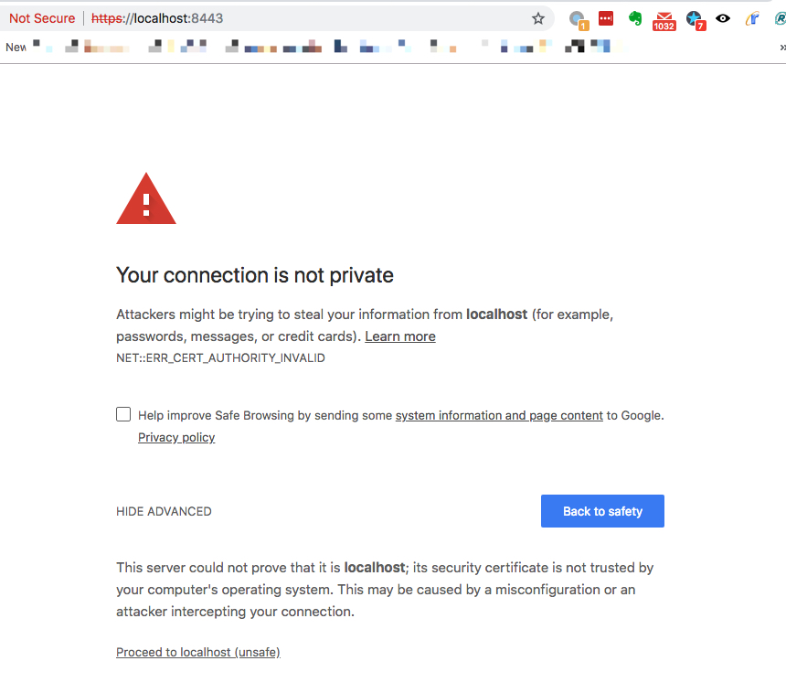
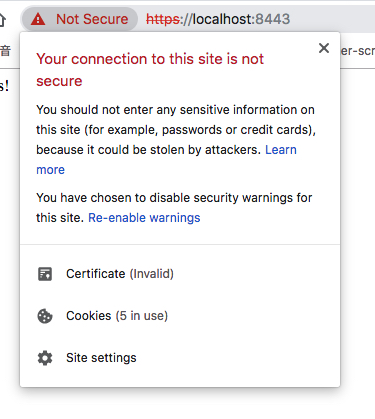
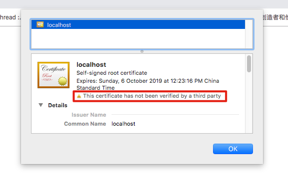

JavaScript Express Https Demo
=============================

生成证书：

```
openssl req -x509 -newkey rsa:4096 -keyout key.pem -out cert.pem -days 365 -subj '/CN=localhost' -nodes
```

```
npm install
npm start
```

- `http`: on port `3000`
- `https`: on port `8443`

注意：
---

虽然我们正确的生成了自签名的证书，但是在Chrome中打开，还是会报错：







原因是这个证书是自己生成的，没有经过第三方的验证。

如果想解决这个问题，可以提前把证书放置到浏览器，或者使用一些第三方的服务来生成证书。
